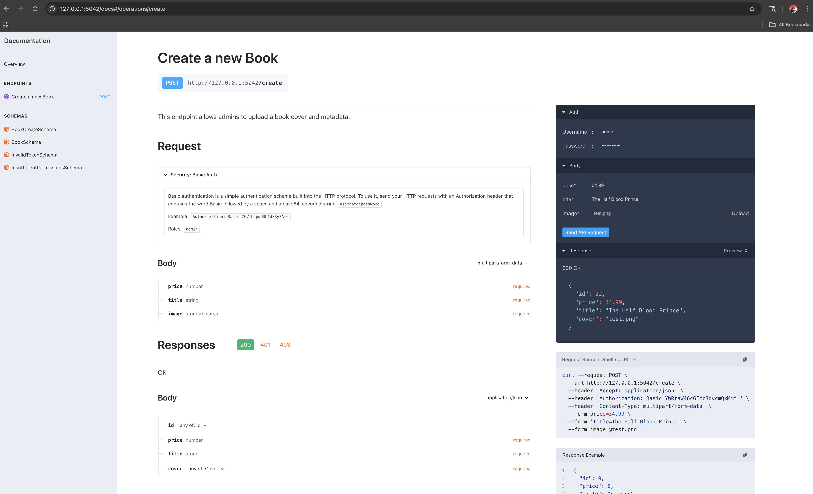

## A light weight Python async framework with batteries included

[](https://github.com/tabotkevin/dyne/actions/workflows/build.yaml)
[](https://dyneapi.readthedocs.io/en/latest/?badge=latest)
[](https://pypi.org/project/dyne/)
[](https://pypi.org/project/dyne/)
[](https://pypi.org/project/dyne/)
[](https://github.com/tabotkevin/dyne/graphs/contributors)

```python

import dyne
from dyne.ext.auth import authenticate
from dyne.ext.io.pydantic import input, output, expect
from dyne.ext.openapi import OpenAPI

app = dyne.App()
api = OpenAPI(app, description=description)


@api.route("/book", methods=["POST"])
@authenticate(basic_auth, role="admin")
@input(BookCreateSchema, location="form")
@output(BookSchema, status_code=201)
@expect({401: "Unauthorized", 400: "Invalid file format"})
async def create_book(req, resp, *, data):
    """
    Create a new Book
    ---
    This endpoint allows admins to upload a book cover and metadata.
    """

    image = data.pop("image")
    await image.asave(f"uploads/{image.filename}") # The image is already validated for extension and size.


    book = Book(**data, cover=image.filename)
    session.add(book)
    session.commit()

    resp.obj = book

```



Dyne delivers a production-ready ASGI foundation out of the box. It features an integrated static file server powered by (`WhiteNoise <http://whitenoise.evans.io/en/stable/>`\_), Jinja2 templating for dynamic rendering, and a high-performance uvloop-based webserver—all optimized with automatic Gzip compression for reduced latency.

## Documentation

See the [documentation](https://dyneapi.readthedocs.io), for more details on features available in dyne.

## Installation

Dyne uses **optional dependencies** (extras) to keep the core package lightweight.  
This allows you to install only the features you need for your specific project.

### Core Installation

To install the minimal ASGI core:

```bash
pip install dyne
```

## Installing Specific Feature Sets

Choose the bundle that fits your technology stack. Note that for most shells (like Zsh on macOS), you should wrap the package name in quotes to handle the brackets correctly.

> **Note:** The use of brackets `[]` is required.

### 1. OpenAPI + (Request Validation & Response Serialization)

Enable automated OpenAPI (Swagger) documentation, request validation and response serialization using your preferred schema library:

#### With Pydantic

```bash
pip install "dyne[openapi_pydantic]"
```

#### With Marshmallow

```bash
pip install "dyne[openapi_marshmallow]"
```

### 2. GraphQL Engines

Integrate a native GraphQL interface and the GraphiQL IDE:

#### With Strawberry

```bash
pip install "dyne[graphql_strawberry]"
```

#### With Graphene

```bash
pip install "dyne[graphql_graphene]"
```

### 3. Full Installation

To install all available features, including:

- Both GraphQL engines
- Both serialization engines
- OpenAPI support
- HTTP client helpers

```bash
pip install "dyne[full]"
```

## The Basic Idea

The primary concept here is to bring the niceties that are brought forth from both Flask
and Falcon and unify them into a single framework, along with some new ideas I have. I
also wanted to take some of the API primitives that are instilled in the Requests
library and put them into a web framework. So, you'll find a lot of parallels here with
Requests.

- Setting `resp.content` sends back bytes.
- Setting `resp.text` sends back unicode, while setting `resp.html` sends back HTML.
- Setting `resp.media` sends back JSON/YAML (`.text`/`.html`/`.content` override this).
- Setting `resp.obj` deserializes SQLAlchemy object(s) using Pydantic or Marshmallow schemas
- Case-insensitive `req.headers` dict (from Requests directly).
- `resp.status_code`, `req.method`, `req.url`, and other familiar friends.

## Ideas

- Flask-style route expression, with new capabilities -- all while using Python 3.6+'s
  new f-string syntax.
- I love Falcon's "every request and response is passed into to each view and mutated"
  methodology, especially `response.media`, and have used it here. In addition to
  supporting JSON, I have decided to support YAML as well, as Kubernetes is slowly
  taking over the world, and it uses YAML for all the things. Content-negotiation and
  all that.
- **A built in testing client that uses the actual Requests you know and love**.
- The ability to mount other WSGI apps easily.
- Automatic gzipped-responses.
- In addition to Falcon's `on_get`, `on_post`, etc methods, dyne features an
  `on_request` method, which gets called on every type of request, much like Requests.
- A production static file server is built-in.
- Uvicorn built-in as a production web server. I would have chosen Gunicorn, but it
  doesn't run on Windows. Plus, Uvicorn serves well to protect against slowloris
  attacks, making nginx unnecessary in production.
- GraphQL support, via Graphene. The goal here is to have any GraphQL query exposable at
  any route, magically.
- Provide an official way to run webpack.
